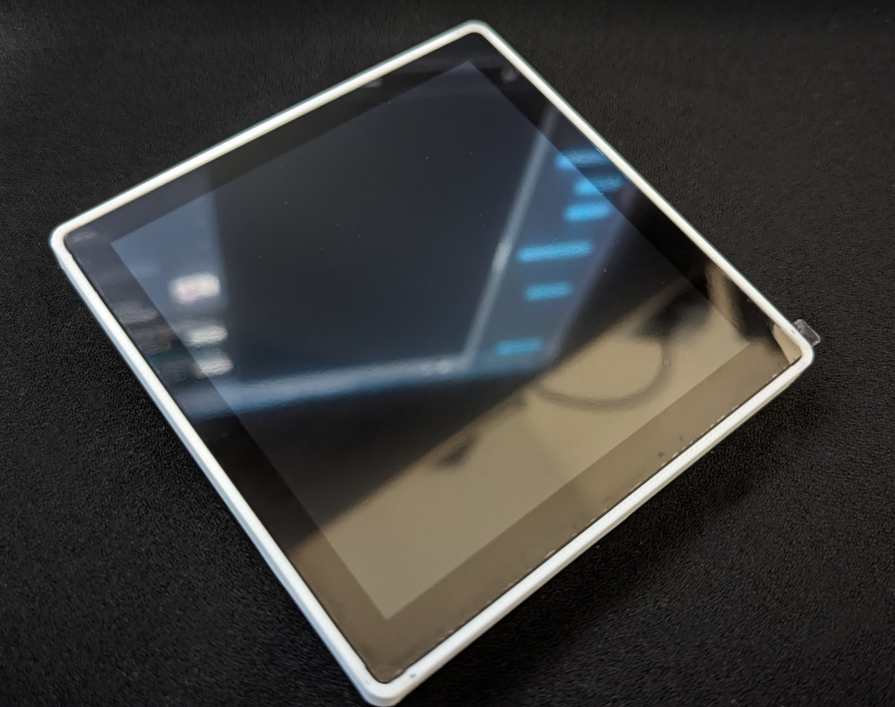
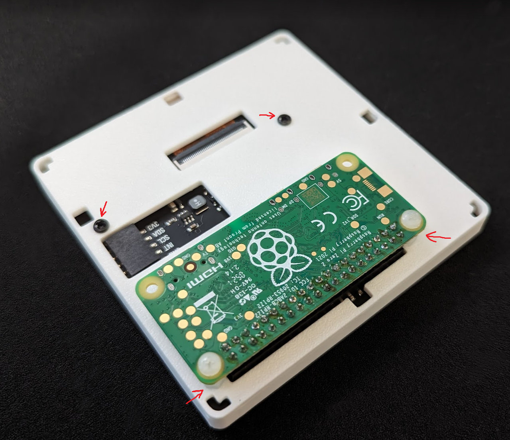
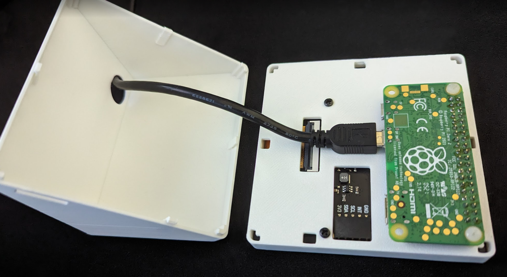
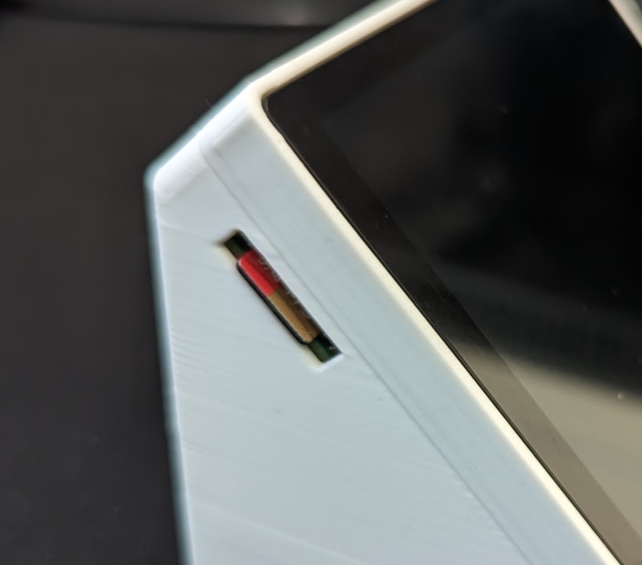
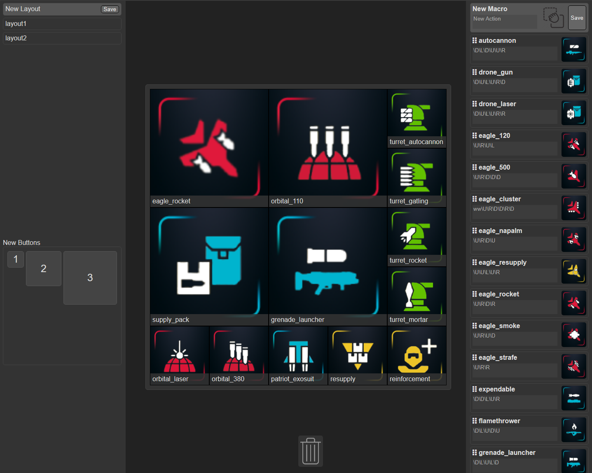
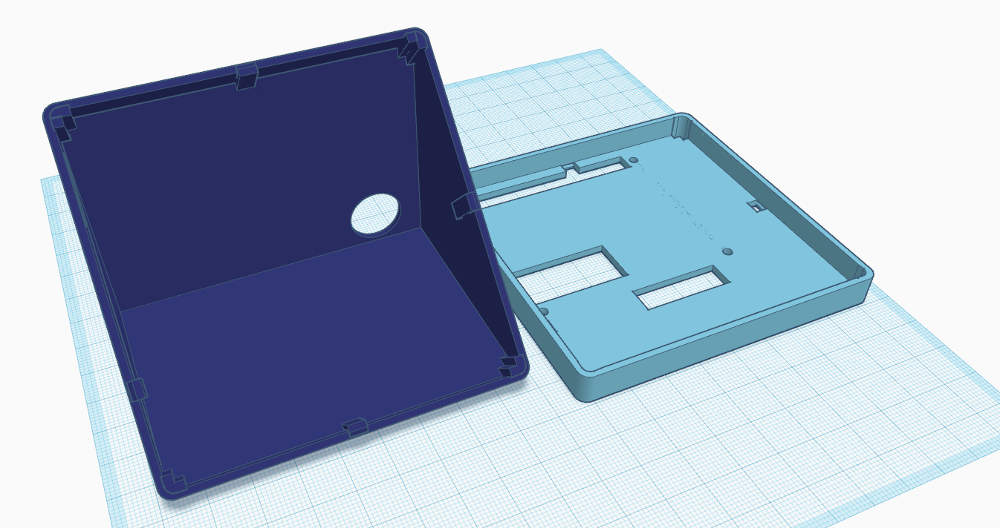

# hotkey

##  About

This project is a desktop style macro board that is configured via a web interface. The device uses a Raspberry Pi Zero operating as a HID gadget to transmit keypresses to the host system.  It incorporates a LCD touchscreen to provide the interface with the user.

This makes a super handy macro board for games like Helldivers 2!!

## Assembly
After printing the chassis, assembly is fairly straight forward.  The screen is pressure fitted into the lid and will only fit in one direction.

The screen is secured using 2 of the included metal screws and 2 short nylon standoffs commonly found in makerspaces, Microcenter, etc.

Once the screen is secured, the Pi Zero is socketed into the 40-pin connector and secured using 2 nylon screws.

A micro-sd cable is routed through the hole in the back of the chassis and connected to the OTG port on the Pi Zero.

Snap the combined chassis front, screen, Pi, and cable to the rear of the chassis.  The fit should be comfortable depending on your print settings.  Insert the SD card into the cutout in the side of the case, taking care to ensure it is inserted properly.

I recommend then using small rubber feet on the bottom of the chassis to prevent it from sliding around.

## Setup
The preferred starting distro is <> image of Debian.  Once logged in via SSH, clone this repository using git.

## User-interface

Layouts and macros are created via a webserver listening on the Raspberry Pi.  The design uses a simplistic drag-and-drop interface for most features.

### Layouts

Layouts are the largest macro building block, and are comprised of a series of buttons of 3 difference sizes arrayed to user preference.  The layouts accomodate up to 25 of the smallest button sizes.  Layouts can be created by editing the "New Layout" at the top left of the page. Layouts can be swapped by clicking their names.  Layouts can be removed by dragging them to the trashcan at the bottom center of the page.

### Buttons

Buttons are visible in the center of the page.  This center grid area displays what is visible on the LCD of the device.  The buttons arrayed in the grid can be dragged around to relocate them.  Additionally, they can be removed by dragging them to the trashcan.  New buttons can be added to the grid by dragging them from the "New Button" area in the bottom left of the web interface.

### Macros

Macros are on the right side of the web interface.  Like with layouts, they can be created via the "New Macro" at the top of the display.  Macros can be edited directly in the textarea found below the macro name.  New images can be added to the macro by simply dragging and dropping a .PNG file onto the old image.  Macros can be added to buttons by dragging them over the target button.  Finally, macros can be deleted by dragging them to the trashcan.

## Hardware Required

This macro box was designed a Raspberry Pi Zero 2 W and the Pimoroni HyperPixel 4.0 square touch screen (https://shop.pimoroni.com/products/hyperpixel-4-square?variant=30138251444307).  Also required is a USB cable and SD card.

## Case Design

Included is an STL file for printing the macro-box case.  The case can be printed without supports and snaps together.

Files for the case can be found in the "printable_case" directory.

## Credits

Example icons from: https://www.reddit.com/r/Helldivers/comments/1ayhofq/hell_divers_2_stratagems_icons_for_streamdeck/