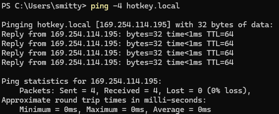

# hotkey

## About

This project is a desktop-style macro board configured via a web interface. It uses a Raspberry Pi Zero operating as a HID gadget to transmit keypresses to the host system and incorporates an LCD touchscreen for user interaction. This device is ideal for games like Helldivers 2!

## Requirements
- 3d printed case
- Raspberry Pi Zero 2 W
- Pimorono HyperPixel 4.0 Square Touchscreen
- Some nylon screws and standoffs
- 8gb SD card
- Micro USB cable
- Tested on Windows 11 using a US keyboard layout

## Case Printing
An [STL file](./printable_case/printable_case.stl) is included for printing the case. The case can be printed without supports and snaps together.


Files for the case can be found in the "printable_case" directory.

## Hardware Setup
After printing the case, assembly is straightforward:

1. **Screen Placement**: The screen is pressure-fitted into the lid and will only fit in one direction.

   

2. **Securing the Screen**: The screen is secured using 2 metal screws and 2 short nylon standoffs commonly found in makerspaces or Microcenter.

   

3. **Connecting the Pi Zero**: The Pi Zero is socketed into the 40-pin connector and secured using 2 nylon screws.

4. **Cable Routing**: A micro-USB cable is routed through the hole in the back of the case and connected to the OTG port on the Pi Zero.

   

5. **Final Assembly**: Snap the front of the case, screen, Pi, and cable onto the rear of the case. The fit should be snug depending on your print settings.

6. **SD Card Insertion**: Insert the SD card into the cutout in the side of the case, ensuring it is inserted correctly.  See software setup below for recommendations on where to start with imaging your SD card.

   

7. **Stabilization**: Optionally, add small rubber feet to the bottom of the case to prevent it from sliding around.

8. **PC Connection**: Connect the USB cable to your host PC.

## Software Setup

The recommended starting distro is a Debian image. Make sure to use the lite variant without a GUI.  This program will write directly to the framebuffer and not use a windowing system like X.  Using the Raspberry Pi imager, the appropriate distro can be found by selecting "Raspberry Pi OS (other)" -> "Raspberry Pi OS (Legacy, 32-bit) Lite". 


Make sure to pre-configure any wireless settings necessary to access your pi.

Next you will need to find your Pi on your wifi and login via SSH or directly through the HDMI and USB.

### Installing
An install script is provided to ease installation after cloning the repository.  Afterwards the Pi should reboot and auto launch the hotkey application.

```
git clone https://github.com/psmitty7373/hotkey
cd hotkey
sudo ./install.sh
```

### Accessing the UI
After rebooting, the Pi will attempt to start both a HID and Ethernet OTG device with your host OS.  You can still access the Pi via your wireless connection too.  The web interface will listen on port 5000.  Just browse to http://pi-ip-address:5000 to get started setting up your macros.  

### Accessing the UI via OTG
If you want to use the ethernet connection, you can locate the pi by pinging hotkey.local.  We use `-4` to locate the ipv4 address.
```
ping.exe -4 hotkey.local
```


You should get ping replies from a 169 address if all goes to plan.  You can access the web-UI by then browsing to http://169.x.x.x:5000

### User Interface

Layouts and macros are created via a web server listening on the Raspberry Pi. The design uses a simplistic drag-and-drop interface for most features.


### Layouts

Layouts are the largest macro building block, comprised of a series of buttons of 3 different sizes arranged to the user's preference. The layouts accommodate up to 25 of the smallest button sizes. Layouts can be created by editing the "New Layout" at the top left of the page. Layouts can be swapped by clicking their names and removed by dragging them to the trashcan at the bottom center of the page.

### Buttons

Buttons are visible in the center grid area of the page, representing what is visible on the device's LCD. They can be dragged around to relocate or remove by dragging them to the trashcan. New buttons can be added to the grid by dragging them from the "New Button" area in the bottom left of the web interface.

### Macros

Macros are on the right side of the web interface. They can be created via the "New Macro" at the top of the display. Macros can be edited directly in the textarea found below the macro name. New images can be added to the macro by dragging and dropping a .PNG file onto the old image. Macros can be added to buttons by dragging them over the target button and deleted by dragging them to the trashcan.

### Macro Special Characters

Most typable characters can be used directly in the macro input box.  However, some special characters are also provided.  They are:

```
\U -> Up Arrow
\D -> Down Arrow
\L -> Left Arrow
\R -> Right Arrow
\n or \r -> Enter
\\ -> \
```

## Credits

- Included icons from: [Helldivers 2 Stratagems Icons for Streamdeck](https://www.reddit.com/r/Helldivers/comments/1ayhofq/hell_divers_2_stratagems_icons_for_streamdeck/)
- Touchscreen driver from: [Pimoroni Python Multitouch](https://github.com/pimoroni/python-multitouch/blob/master/library/ft5406.py)